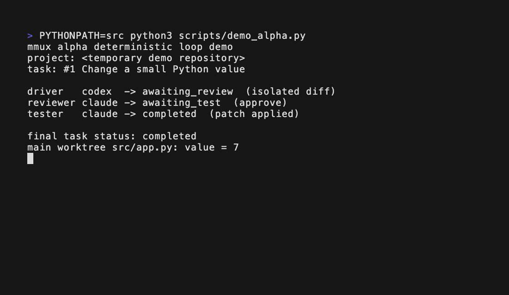

# mmux

Deterministic multi-agent pair programming over tmux.

[简体中文说明](README.zh-CN.md)



- Two different LLMs pair on the same task: one drives, the other reviews.
- A deterministic state machine, not an LLM, decides what is done.
- Bounded runs with `--minutes N` and checkpoints; no infinite token burn.

Unlike model-chat agent frameworks where LLMs negotiate outcomes, mmux keeps the
referee outside the model loop. Codex and Claude Code can write, review, and
discuss in visible tmux panes; a deterministic supervisor decides state
transitions with timers, role leases, resource locks, git facts, and test
results.

mmux also dogfoods project-local `AGENTS.md` briefs: resident agents receive the
same kind of repository context humans use to keep long-running work scoped.

> Alpha: mmux is ready for controlled experiments and demo runs. It is not yet a
> production-grade unattended coding system.

Quick install:

```bash
curl -fsSL https://raw.githubusercontent.com/hanaukyo47/mmux/main/install.sh | sh
```

Demo and launch materials:

- [Demo guide](docs/demo.md)
- [Launch copy](docs/launch.md)

Five-minute sandbox:

```bash
git clone https://github.com/hanaukyo47/mmux-example-todo.git
cd mmux-example-todo
./demo.sh
```

The sandbox uses deterministic fake `codex` / `claude` commands, so it does not
spend model tokens. It still runs the real mmux supervisor loop: frontier task,
driver diff, peer review request-changes, driver fix, reviewer approve, tester
gate, patch applied.

## Current Scope

This repository starts as the control-plane skeleton:

- `mmux init` creates a project-local `.mmux/` state directory.
- `mmux doctor` checks local dependencies such as `tmux`, `codex`, and `claude`.
- `mmux inspect` detects project ecosystems, languages, markers, active checks,
  and suggested checks without using an LLM.
- `mmux frontier` shows deterministic next-task candidates from repository
  facts such as TODOs, test gaps, and suggested checks.
- `mmux start` creates a four-pane tmux workspace for supervisor, Codex worker,
  Claude worker, and logs.
- `mmux run --minutes N` starts the tmux workspace for a bounded wall-clock
  window, adds conservative default tasks when the open queue is empty and time
  remains, writes checkpoints, stops it automatically, and prints a task
  summary.
- `mmux start/run --resident-agents` opens persistent interactive Codex and
  Claude panes with fixed resident worktrees under `.mmux/resident/`, and
  includes a bounded project-local `AGENTS.md` brief when one exists.
- `mmux tell` sends `MMUX_TASK`, `MMUX_REVIEW`, or `MMUX_NOTE` protocol lines to
  a resident agent through tmux.
- `mmux report done|blocked` lets resident agents report task outcomes through
  the state channel instead of relying on terminal text.
- The supervisor still captures resident `MMUX_DONE` and `MMUX_BLOCKED` lines
  from tmux panes as an observable fallback and records them as deterministic
  events.
- Resident `MMUX_DONE task=#N` freezes the agent's resident diff into a task
  worktree, resets the resident worktree, and moves the task to
  `awaiting_review`; reviewer notes and tester still gate the path to main.
- Resident `MMUX_BLOCKED task=#N` records the blocked reason and sends the peer
  resident agent a deterministic `MMUX_TASK` takeover request through tmux.
- A task that receives a second resident `MMUX_BLOCKED` is escalated to
  `blocked`, freeing the timed run to continue with other work.
- Driver diffs pass through a peer reviewer before tester; review can approve,
  request changes, or be bypassed on invalid output without blocking the run.
- `mmux status` prints deterministic state from `.mmux/state.db`.
- `mmux tasks` prints the deterministic task queue.
- `mmux task requeue #N` moves a blocked or failed task back to `pending`.
- `mmux roles` prints role leases and worker heartbeats.
- `mmux locks` prints resource locks.
- `mmux lease acquire/release` exercises deterministic role leasing.
- `mmux lock acquire/release` exercises deterministic resource locking.

By default, workers record heartbeat and lease state without editing code. Use
`mmux run --minutes N --execute-agents` for a bounded autonomous window, or
`mmux start --execute-agents` for manual tmux control. With execution enabled,
the worker holding `driver` claims a pending task, acquires its resource lock,
creates an isolated git worktree, and runs a structured plan step (Codex or
Claude Code outputs a `READ` / `PLAN` / `RISKS` artifact ending in
`MMUX_PLAN PROCEED` or `MMUX_PLAN ABORT`). A `PROCEED` plan is then
reviewed inline (same `MMUX_REVIEW APPROVE` / `REQUEST_CHANGES` protocol
as the diff reviewer). Approved plans flow into the subsequent diff step
as context; the first `REQUEST_CHANGES` requeues the task so the next
driver can plan again, and a second rejection moves the task to
`blocked`. `ABORT` short-circuits the task to `no_change` without
burning a diff attempt.
Accepted driver diffs move to `awaiting_review`; the peer `reviewer` can
approve or request changes, and only reviewed or bypassed diffs move to
`awaiting_test`. The worker holding `tester` runs deterministic checks and
only then applies the patch back to the main worktree. After the patch
applies, a summarizer call writes a compact `act_summary` into the task
payload (3-5 bullets covering what changed, what verified it, surprises,
and one watch-out for next time). The summary is best-effort: a
summarizer failure logs but never blocks task completion. Reflection
that turns these summaries back into new tasks is not yet wired up.

Resident mode is for visibility and long-lived agent context. With
`--resident-agents`, the visible Codex and Claude panes are real interactive
sessions, and the tmux session becomes their shared coordination surface. The
current deterministic worker/gate path is still the authority for applying code:
when `--resident-agents --execute-agents` are used together, mmux opens a second
`automation` window for the existing non-interactive workers while the resident
agents remain available for discussion and human takeover.

## Install

The same one-line installer is shown at the top of this README:

```bash
curl -fsSL https://raw.githubusercontent.com/hanaukyo47/mmux/main/install.sh | sh
```

The installer clones mmux into `~/.local/share/mmux/repo`, creates an isolated
virtual environment in `~/.local/share/mmux/venv`, and links `mmux` into
`~/.local/bin`. It does not use `sudo`.

If `tmux` is missing on macOS and Homebrew is already installed:

```bash
curl -fsSL https://raw.githubusercontent.com/hanaukyo47/mmux/main/install.sh | MMUX_INSTALL_DEPS=1 sh
```

## Quick Start

To try mmux without touching a real project, use the example repository:

```bash
git clone https://github.com/hanaukyo47/mmux-example-todo.git
cd mmux-example-todo
./demo.sh
```

That deterministic sandbox is the recommended first run. It prepends local fake
agent commands to `PATH`, then runs a two-minute `mmux run --execute-agents`
window.

For a low-friction first run:

```bash
cd /path/to/project
mmux doctor
mmux inspect .
mmux run . --minutes 30
```

This observes only. It initializes `.mmux/`, profiles the project, adds a
conservative default task if the queue is empty, starts tmux, writes
checkpoints, replenishes default tasks when the open queue is exhausted and time
remains, and stops at the deadline. To let Codex and Claude Code actually edit
code inside the deterministic gates:

```bash
mmux run . --minutes 30 --execute-agents
```

For the experimental resident-agent view:

```bash
mmux run . --minutes 30 --resident-agents
```

## Install For Local Development

```bash
cd /path/to/mmux
python3 -m venv .venv
. .venv/bin/activate
python -m pip install -e .
```

Run without installation:

```bash
cd /path/to/mmux
PYTHONPATH=src python3 -m mmux.cli doctor
```

## Commands

```bash
mmux init /path/to/project --task "Improve this project continuously"
mmux doctor
mmux inspect /path/to/project
mmux frontier /path/to/project
mmux run /path/to/project --minutes 30
mmux run /path/to/project --minutes 30 --execute-agents
mmux run /path/to/project --minutes 30 --resident-agents
mmux run /path/to/project --minutes 30 --resident-agents --execute-agents
mmux run /path/to/project --minutes 30 --no-default-task
mmux run /path/to/project --minutes 30 --agent-no-output-seconds 120
mmux start /path/to/project
mmux start /path/to/project --execute-agents
mmux start /path/to/project --resident-agents
mmux tell claude note "Please review the Codex plan" --project /path/to/project
mmux report done --task-id 12 "implemented" --agent codex --project /path/to/project
mmux report blocked --task-id 12 "needs API decision" --agent claude --project /path/to/project
mmux attach /path/to/project
mmux status /path/to/project
mmux tasks /path/to/project
mmux task add "Add focused tests" --resource tests --project /path/to/project
mmux task requeue #12 --project /path/to/project --reason "human decision made"
mmux roles /path/to/project
mmux locks /path/to/project
mmux lease acquire scout --agent codex --project /path/to/project
mmux lease release scout --agent codex --project /path/to/project
mmux lock acquire src --agent codex --project /path/to/project
mmux lock release src --agent codex --project /path/to/project
mmux stop /path/to/project
```

## Design Rules

- The supervisor is deterministic and does not call a model.
- Agents are workers, not owners of global control.
- Roles are leased, not hard-coded to specific agents.
- A role lease has a generation token; stale work is ignored.
- Resource locks prevent concurrent writes to the same files or modules.
- Agent execution happens in task git worktrees under `.mmux/worktrees/`.
- Resident agent context lives in fixed git worktrees under `.mmux/resident/`.
- Resident agent outcome reporting prefers the `mmux report` state channel;
  tmux protocol lines remain a fallback for visibility.
- Resident `MMUX_DONE` can hand work to review; it is not treated as acceptance.
- Resident `MMUX_BLOCKED` requests peer takeover without failing the task.
- Repeated resident blocks stop ping-pong by moving the task to `blocked`.
- Blocked tasks can be manually requeued after human recovery.
- Diff policy rejects protected paths and files outside the task resource.
- Reviewer output is structured as approve/request-changes; invalid or timed-out
  reviews are logged and bypassed to tester so review cannot deadlock the run.
- Tester gate infers zero-config local checks before applying accepted patches.
- Suite-level tester checks are baseline-aware, so pre-existing suite failures
  are logged without automatically rejecting unrelated patches.
- Pending, awaiting-review, or awaiting-test work gets deterministic
  `driver/reviewer/tester` priority during timed runs.
- Agent adapters have bounded runtime and no-output timeouts tied to the timed
  run deadline.
- Adapter timeout/no-output failures requeue the task and put that agent on
  cooldown, so another agent can take the next driver lease.
- Stopping a run requeues unfinished `running`, `running_review`, and
  `running_test` tasks.
- Time windows drive the loop; round counts are only internal diagnostics.
- Queue replenishment prefers deterministic frontier candidates before generic
  default tasks.
- tmux is the observation layer, not the source of truth.

See [docs/design.md](docs/design.md) for the initial architecture.
